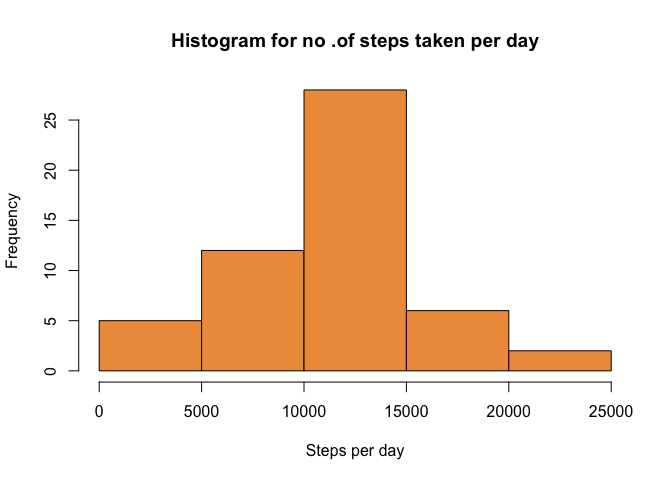
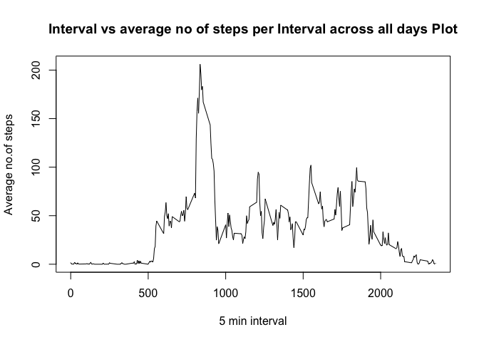
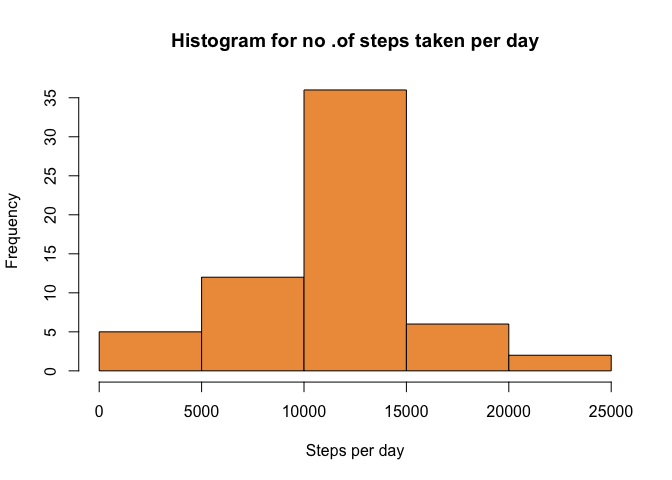
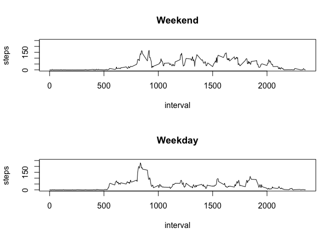

# Reproducible Research: Peer Assessment 1


## Loading and preprocessing the data

```r
dat=read.csv("activity.csv");
dev.off();
```

```
## null device 
##           1
```
## What is mean total number of steps taken per day?
Ignoring NAs and calculating total number of Steps taken per day

```r
dat1=na.omit(dat);
steps.date= aggregate(steps ~ date, data = dat1, FUN = sum)
```
Plotting the Histogram

```r
hist(steps.date$steps,col="tan2",xlab="Steps per day",main="Histogram for no .of steps taken per day")
```

<!-- -->
Calculating and reporting the mean and median of the total number of steps taken per day


```r
cat("Mean steps/day: ", mean(steps.date$steps));
```

```
## Mean steps/day:  10766.19
```

```r
cat("Median steps/day: ", median(steps.date$steps));
```

```
## Median steps/day:  10765
```
## What is the average daily activity pattern?
Calculating the average number of steps taken per interval, averaged across all days 


```r
steps.interval= aggregate(steps ~ interval, data = dat1, FUN = mean);
```
Plotting Interval vs average  no.of steps

```r
plot(steps.interval, type="l", main="Interval vs average no of steps per Interval across all days Plot",xlab="5 min interval",ylab="Average no.of steps");
```

<!-- -->
5-minute interval that contains the maximum number of steps (averaged across days)


```r
cat("Interval with maximum average steps: ", steps.interval$interval[which.max(steps.interval$steps)]);
```

```
## Interval with maximum average steps:  835
```
## Imputing missing values
Calculating and reporting the total number of missing values in the dataset (i.e. the total number of rows with 𝙽𝙰s)


```r
cat("Number of NAs: ", sum(is.na(dat)));
```

```
## Number of NAs:  2304
```

I created a new data set and substituted the NAs with the mean "steps" value for that interval across days


```r
dat2=dat;
for (i in 1:nrow(dat2))
{
  if(is.na(dat2)[i])
  {
    average_steps_for_interval=steps.interval[which(steps.interval[,"interval"]==dat2[i,"interval"]),"steps"];
    dat2[i,"steps"]= average_steps_for_interval;
  }
}
```
The new data set has now NAs substituted.

Histogram of the total number of steps taken each day


```r
steps.date2= aggregate(steps ~ date, data = dat2, FUN = sum);
hist(steps.date2$steps,col="tan2",xlab="Steps per day",main="Histogram for no .of steps taken per day");
```

<!-- -->
Mean and median total number of steps taken per day with the Imputed Data set


```r
cat("Mean steps/day Imputed: ", mean(steps.date2$steps));
```

```
## Mean steps/day Imputed:  10766.19
```

```r
cat("Median steps/day Imputed: ",median(steps.date2$steps)); 
```

```
## Median steps/day Imputed:  10766.19
```
####Assessment on the differance from the estimates.

I see that the mean of total daily number of steps remains the same while the median increases slightly to the mean value.THe frequency for the slot that contains mean and medium value of the steps goes higher in the histogram chart.

## Are there differences in activity patterns between weekdays and weekends?
### Yes, there are differences.
Categorising activity by weekday and weekend in the imputed data set.

```r
dat2$date=as.POSIXct(dat2$date,format="%Y-%m-%d");
day=function(date)
{
  if (weekdays(date) %in% c("Saturday", "Sunday"))
  {
    "weekend";
  }
  else
    "weekday";
}
dat2$day=as.factor(sapply(dat2$date,day))
```
Panel plot of activity by interval divided into Weekday and Weekend.


```r
par(mfrow = c(2, 1))
steps.weekend <- aggregate(steps ~ interval, data = dat2, subset = dat2$day == "weekend", FUN = mean)
plot(steps.weekend, type = "l", main = "Weekend", ylim=c(0,250))
steps.weekday <- aggregate(steps ~ interval, data = dat2, subset = dat2$day == "weekday", FUN = mean)
plot(steps.weekday, type = "l", main = "Weekday", ylim=c(0,250))
```

<!-- -->


Looking at the two plots, I see that the weekend plot has more distributed activity while weekday has a spurt of activity. 

Maximum of Weekday activity seems higher than weekend but the mean of weekend seems to be higher than weekday. It is further verified with the below calculations.


```r
cat("Weekend mean: ", mean(steps.weekend$steps));
```

```
## Weekend mean:  42.3664
```

```r
cat("Weekday mean: ", mean(steps.weekday$steps));
```

```
## Weekday mean:  35.61058
```

```r
cat("Weekend max: ", max(steps.weekend$steps));
```

```
## Weekend max:  166.6392
```

```r
cat("Weekday max: ", max(steps.weekday$steps));
```

```
## Weekday max:  230.3782
```
